# Deploying IPsec VPN in Yandex Cloud using a security gateway

Contents:
* [Introduction](#overview)
* [Topology and basic elements](#sgw-topology)
* [IPsec protocol parameters](#sgw-ipsec)
* [Specifics of the YC-SGW security gateway](#sgw-details)
* [How to deploy this solution with a Terraform module](#sgw-tf)
* [How to create a configuration file for Remote-SGW](#remote-config)
* [How to perform Terraform deployment](#sgw-tf-apply)
* [Module specification](#spec)


## Introduction <a id="overview"/></a>

Any information service has a lifecycle. Constantly evolving and changing, they need resources to grow. While deploying new IT resources is a major time sink in traditional enterprise data centers, cloud technologies allow data centers to expand their limits quickly and almost infinitely.

When hosting some of your resources in a cloud, you must provide their secure networking with those already running in your enterprise data center. This is where a certain technology is employed to create secure connections between such a data center and its cloud infrastructure.

Virtual networking technologies (VPNs) such as [IPsec](https://www.ietf.org/rfc/rfc2401.txt), [WireGuard](https://www.wireguard.com/), etc. combine data center infrastructure and cloud infrastructure into a single information space.

This article describes the Security Gateway solution for establishing a secure `IPsec`-based connection between an enterprise data center and a cloud infrastructure in `Yandex Cloud` over the Internet.

Why we prefer IPsec is due to its wide support from many vendors, across a vast range of network devices (both physical and virtual).

This solution employs [strongSwan](https://github.com/strongswan/strongswan), an open-source product, as a security gateway.


## Topology and basic elements <a id="sgw-topology"/></a>

`IPsec site to site VPN` stands for a secured IPsec connection between an enterprise data center and cloud infrastructure in Yandex Cloud. The chart below shows an example of its typical topology:

<p align="center">
    
</p>

Yandex Cloud infrastructure houses `subnet-1`, `subnet-2`, and `subnet-3`; in those subnets, a part of information resources is located.

The `Remote site` data center houses `subnet-5` and `subnet-6`; those are for the other part of the information resources.

The YC-SGW and Remote-SGW security gateways connect the above network segments using `IPsec Tunnel` built over the Internet. A security gateway encrypts traffic while transmitting it to a neighboring network segment through an IPsec tunnel.


The most important objects shown on the chart are:

* `YC-SGW`: Yandex Cloud security gateway, a key element of this solution. This is deployed as a VM based on [strongSwan](https://docs.strongswan.org/). To ensure that our IPsec tunnel works as intended, YC-SGW and Remote-SGW (the remote security gateway in the data center) must operate consistently. YC-SGWis deployed in `subnet-4`, a dedicated Yandex Cloud subnet. In certain cases, engaging a separate subnet to deploy YC-SGW avoids traffic loops during routing.

* `Remote-SGW`: Security gateway in the data center. In this example, the security gateway is implemented based on a [Cisco](https://www.cisco.com) hardware or software router with the `Cisco IOS-XE` operating system.

* `Network-1`: [Cloud network](https://yandex.cloud/docs/vpc/concepts/network#network) in the Yandex Cloud folder.

* `subnet1`, `subnet2`, and `subnet3`: [Subnets residing in the cloud network](https://yandex.cloud/docs/vpc/concepts/network#subnet), each created in a separate [availability zone](https://yandex.cloud/docs/overview/concepts/geo-scope). These subnets are used to deploy cloud resources intended to work with on-prem resources in the data center.

* `subnet-5` and `subnet-6`: Connected to the Remote-SGW via logical interfaces *(Gig1.11 and Gig1.12 sub-interfaces)* of a single physical trunk port (`Gig1`). For configuration details for the security gateway's network interfaces, see the espective chart in the **Remote-SGW interfaces** table.

* `sgw-rt`: [Route table](https://yandex.cloud/docs/vpc/concepts/static-routes) in the `Network-1` cloud network. It routes traffic towards `subnet-5` and `subnet-6` through the YC-SGW security gateway. To employ the route table, it must be bound to the subnets (`subnet-1`, `subnet-2`, and `subnet-3`).

* `YC-SGW route table`: Shared route table within the YC-SGW Linux VM, to which the routes for `subnet-5` and `subnet-6` are added. Traffic to these subnets will be sent through an IPsec tunnel.

* `Remote-SGW route table`: Route table of the Remote-SGW security gateway, to which the routes to the subnets in Yandex Cloud (`subnet-1`, `subnet-2`, and `subnet-3`) are added. Traffic to these subnets will be sent through an IPsec tunnel.


## IPsec parameters <a id="sgw-ipsec"/></a>

For an IPsec connection, you need to configure an IPsec policy, or profile, for the security gateways on both sides of the connection. This solution employs the following parameters:

* `policy_name`: IPsec policy (profile) name.

* `ike_proposal`: [Internet Key Exchange Version 2 (IKEv2)](https://docs.strongswan.org/docs/5.9/howtos/ipsecProtocol.html#_internet_key_exchange_version_2_ikev2). This cipher will be used to encrypt the channel to manage your IPsec connection.

* `esp_proposal`: [Encapsulating Security Payload](https://docs.strongswan.org/docs/5.9/howtos/ipsecProtocol.html#_encapsulating_security_payload_esp). This cipher will be used to encrypt the data to transmit.

* `psk`: [Pre-Shared Key](https://docs.strongswan.org/docs/5.9/howtos/ipsecProtocol.html#_psk_based_authentication). This key (password) will be used to establish your IPsec connection.

The values for the `ike_proposal` and `esp_proposal` are based on the [strongSwan notation](https://docs.strongswan.org/docs/5.9/config/IKEv2CipherSuites.html).

For IPsec Policy parameters, this example uses the values as follows:

```yml
policy_name: yc-ipsec
ike_proposal: aes128gcm16-prfsha256-ecp256
esp_proposal: aes128gcm16
psk: Sup#erPa85s
```

See [Introduction to IPsec](https://docs.strongswan.org/docs/5.9/howtos/ipsecProtocol.html) to learn about its basic principles.


## Specifics of the YC-SGW security gateway <a id="sgw-details"/></a>

YC-SGW is implemented as a VM image that includes the following components:
* Ubuntu Linux 22.04.
* Docker Daemon and Docker Client.
* [strongSwan](https://github.com/strongswan/strongswan) Docker container. You can download it from here: `cr.yandex/crpjfmfou6gflobbfvfv/strongswan:5.9.9`.

Networking within YC-SGW has the following specifics:

* The VM has only one network interface: `eth0`, which connects to the Yandex Cloud virtual network. The IP address on this network interface is the gateway (next-hop) for routes to `subnet-5` and `subnet-6` from `subnet-1`, `subnet-2`, or `subnet-3`. Through the same network interface, the traffic is routed to the Internet via the 1:1 NAT subsystem part of the Yandex Cloud virtual network.

* The VM allows kernel-level packet routing (`IP Forwarding`).

* In the VM, IPv6 is disabled.

* Once the `strongSwan` container starts, the [host (VM) network](https://docs.docker.com/network/host/) is forwarded into it.

* For easy operation of the security gateway, the `strongSwan` container is configured to operate in [Route-based VPN](https://docs.strongswan.org/docs/5.9/features/routeBasedVpn.html) mode. For this purpose, an [XFRM interface](https://docs.strongswan.org/docs/5.9/features/routeBasedVpn.html#_xfrm_interfaces_on_linux) is created in the VM. Thus, the YC-SGW obtains an additional virtual network interface, `ipsec0`, through which your traffic can be routed to the IPsec tunnel with the common `ip route` Linux command. All this does not require any changes to the IPsec settings inside the container.


## How to deploy this solution with the IPSEC-SGW Terraform module <a id="sgw-tf"/></a>

### Deployment results

When performing this Terraform deployment in Yandex Cloud, the following objects will be created:

* New separate subnet (`subnet-4`) in the existing network, to deploy the YC-SGW security gateway in it.

* One route table (`sgw-rt`) common to all subnets to protect. This table will house routes to all remote subnets as listed above, and will be applied to all listed Yandex Cloud subnets. If needed, a NAT gateway will be created on the network, along with a relevant entry, in the route table, with a default route pointing to this gateway as the one to send outgoing traffic to the Internet.

* The YC-SGW VM will be created from a pre-built image in Yandex Cloud. 

* When creating your YC-SGW VM, it will be assigned a public static IP address; additionally, a security group will be created.

* After your YC-SGW solution is deployed, a specific configuration file will be created for the data center's security gateway, to configure it consistently with the YC-SGW one. The name of the configuration file will match the security gateway name specified in the input parameters (see below).   


### Input parameters for the IPSEC-SGQ module

See [main.tf](./examples/main.tf) for an example of the deployment description.

Before invoking the module, you need to feed the following input objects to it:

* `yc_sgw`: This object describes the attributes to deploy a security gateway in Yandex Cloud:
  - `name`: Name to use when creating various objects related to the YC-SGW.
  - `folder_name`: Name of the cloud folder to create the YC-SGW VM in.
  - `image_folder_id`: ID of the cloud folder containing your prepared image to deploy the YC-SGW from.
  - `image_name`: Name of the file, i.e., your prepared image to deploy the YC-SGW from.
  - `zone`: ID of the availability zone to create your YC-SGW in.
  - `subnet`: IPv4 prefix for the subnet that will be created to connect your YC-SGW there.
  - `inside_ip`: IP address in the `subnet`, for the `eth0` YC-SGW network interface.
  - `admin_name`: Name of the admin user that will connect to your YC-SGW over SSH.
  - `admin_key_path`: Local path to the file containing the public key to authenticate the admin user. This key will be uploaded to the YC-SGW VM when creating it.

* `IPsec Policy`: This object describes the IPsec configuration attributes: `policy_name`, `ike_proposal`, `esp_proposal`, and `psk`. You can learn more about these parameters [here](#sgw-ipsec).

* `yc_subnets`: This object describes network entities in Yandex Cloud. Its attributes are as follows:
  - `net_name`: Name of the network where your YC-SGW VM will be created. All subnets protected by your YC-SGW are assumed to reside in this network as well.
  - `rt_name`: Name of the route table that will be used to route traffic from the protected subnets through the security gateway and on to the IPsec tunnel.
  - `prefix_list`: List of IPv4 prefixes of the protected subnets from which the traffic will be forwarded through the security gateway.
  - `rt_internet_access`: Special flag to add a default route to the `rt_name` route table to access the Internet via a NAT gateway. The default value is `false`.
  - `force_subnets_update`: Special flag to apply the created route table to previously created subnets within this Terraform deployment. The default value is `false`, which means no changes are made to the subnet configurations; instead, a specific Terraform output value, `yc_rt_cmd`, stores a command line to make these changes at a scheduled time. 

* `remote_subnets`: This object is a list of IPv4 prefixes for subnets behind the remote security gateway.

* `remote_sgw`: This object describes the attributes of an existing remote security gateway:
  - `name`: Name of your remote security gateway, used to generate the configuration file.
  - `type`: Type of your remote security gateway. Currently, the following gateway types are supported: `cisco-iosxe`, `cisco-asa`, `mikrotik-chr`, and `unknown`.
  - `outside_ip`: Public (outside) IP address on the remote security gateway side.


### How to perform Terraform deployment of YC-SGW <a id="sgw-tf-apply"/></a>

```bash
cd examples
source env-yc.sh
terraform init
terraform apply
```

## Module specification <a id="spec"/></a>

<!-- BEGIN_TF_DOCS -->
### Requirements

| Name | Version |
|------|---------|
| <a name="requirement_local"></a> [local](#requirement\_local) | ~> 2.4.0 |
| <a name="requirement_null"></a> [null](#requirement\_null) | ~> 3.2.1 |
| <a name="requirement_yandex"></a> [yandex](#requirement\_yandex) | ~> 0.89.0 |

### Providers

| Name | Version |
|------|---------|
| <a name="provider_local"></a> [local](#provider\_local) | ~> 2.4.0 |
| <a name="provider_yandex"></a> [yandex](#provider\_yandex) | ~> 0.89.0 |
| <a name="provider_null"></a> [null](#provider\_null) | ~> 3.2.1 |

### Modules

No modules.

### Resources

| Name | Type |
|------|------|
| [local_file.remote_ipsec_config](https://registry.terraform.io/providers/hashicorp/local/latest/docs/resources/file) | resource |
| [null_resource.yc_subnets_update](https://registry.terraform.io/providers/hashicorp/null/latest/docs/resources/resource) | resource |
| [yandex_compute_instance.sgw](https://registry.terraform.io/providers/yandex-cloud/yandex/latest/docs/resources/compute_instance) | resource |
| [yandex_vpc_address.sgw_public_ip](https://registry.terraform.io/providers/yandex-cloud/yandex/latest/docs/resources/vpc_address) | resource |
| [yandex_vpc_gateway.egress_gw](https://registry.terraform.io/providers/yandex-cloud/yandex/latest/docs/resources/vpc_gateway) | resource |
| [yandex_vpc_route_table.sgw_rt](https://registry.terraform.io/providers/yandex-cloud/yandex/latest/docs/resources/vpc_route_table) | resource |
| [yandex_vpc_security_group.sgw_sg](https://registry.terraform.io/providers/yandex-cloud/yandex/latest/docs/resources/vpc_security_group) | resource |
| [yandex_vpc_subnet.sgw_subnet](https://registry.terraform.io/providers/yandex-cloud/yandex/latest/docs/resources/vpc_subnet) | resource |
| [yandex_compute_image.sgw_image](https://registry.terraform.io/providers/yandex-cloud/yandex/latest/docs/data-sources/compute_image) | data source |
| [yandex_resourcemanager_folder.sgw_folder](https://registry.terraform.io/providers/yandex-cloud/yandex/latest/docs/data-sources/resourcemanager_folder) | data source |
| [yandex_vpc_network.yc_net](https://registry.terraform.io/providers/yandex-cloud/yandex/latest/docs/data-sources/vpc_network) | data source |
| [yandex_vpc_subnet.yc_sub_all](https://registry.terraform.io/providers/yandex-cloud/yandex/latest/docs/data-sources/vpc_subnet) | data source |

### Inputs

| Name | Description | Type | Default | Required |
|------|-------------|------|---------|:--------:|
| <a name="input_cloud_id"></a> [cloud\_id](#input\_cloud\_id) | YC cloud-id. Taken from environment variable. | `any` | n/a | yes |
| <a name="input_folder_id"></a> [folder\_id](#input\_folder\_id) | YC folder-id. Taken from environment variable. | `any` | n/a | yes |
| <a name="input_ipsec_policy"></a> [ipsec\_policy](#input\_ipsec\_policy) | IPsec parameters for both sides | <pre>object(<br>    {<br>      policy_name  = string<br>      ike_proposal = string<br>      esp_proposal = string<br>      psk          = string<br>  })</pre> | <pre>{<br>  "esp_proposal": null,<br>  "ike_proposal": null,<br>  "policy_name": null,<br>  "psk": null<br>}</pre> | no |
| <a name="input_yc_sgw"></a> [yc\_sgw](#input\_yc\_sgw) | YC IPsec SGW | <pre>object(<br>    {<br>      name            = string<br>      folder_name     = string<br>      image_folder_id = string<br>      image_name      = string<br>      zone            = string<br>      subnet          = string<br>      inside_ip       = string<br>      admin_name      = string<br>      admin_key_path  = string<br>  })</pre> | <pre>{<br>  "admin_key_path": null,<br>  "admin_name": null,<br>  "folder_name": null,<br>  "image_folder_id": "standard-images",<br>  "image_name": null,<br>  "inside_ip": null,<br>  "name": null,<br>  "subnet": null,<br>  "zone": null<br>}</pre> | no |
| <a name="input_yc_subnets"></a> [yc\_subnets](#input\_yc\_subnets) | YC IP subnet prefixes | <pre>object(<br>    {<br>      net_name             = string<br>      prefix_list          = list(string)<br>      rt_name              = string<br>      rt_internet_access   = bool<br>      force_subnets_update = bool<br>  })</pre> | <pre>{<br>  "force_subnets_update": false,<br>  "net_name": null,<br>  "prefix_list": null,<br>  "rt_internet_access": false,<br>  "rt_name": null<br>}</pre> | no |
| <a name="input_remote_sgw"></a> [remote\_sgw](#input\_remote\_sgw) | Remote IPsec Security Gateway (SGW) | <pre>object(<br>    {<br>      name       = string<br>      type       = string<br>      outside_ip = string<br>  })</pre> | <pre>{<br>  "name": null,<br>  "outside_ip": null,<br>  "type": "unknown"<br>}</pre> | no |
| <a name="input_remote_subnets"></a> [remote\_subnets](#input\_remote\_subnets) | Yandex Cloud Subnet prefixes list | `list(string)` | `null` | no |
| <a name="input_labels"></a> [labels](#input\_labels) | A set of key/value label pairs to assign. | `map(string)` | `null` | no |

### Outputs

| Name | Description |
|------|-------------|
| <a name="output_subnets_pairs"></a> [subnets\_pairs](#output\_subnets\_pairs) | Subnet pairs for Remote SGW which is not supported Route-based policies, such as Mikrotik CHR. |
| <a name="output_yc_rt_cmd"></a> [yc\_rt\_cmd](#output\_yc\_rt\_cmd) | Provide yc CLI command string for change traffic flow via route-table manually. |
<!-- END_TF_DOCS -->
